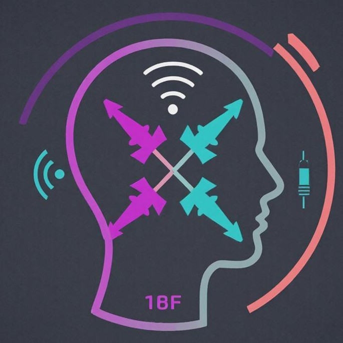
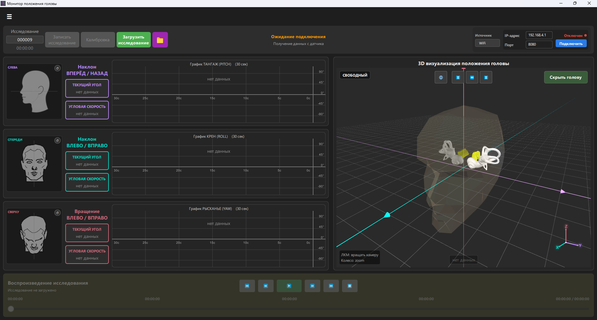
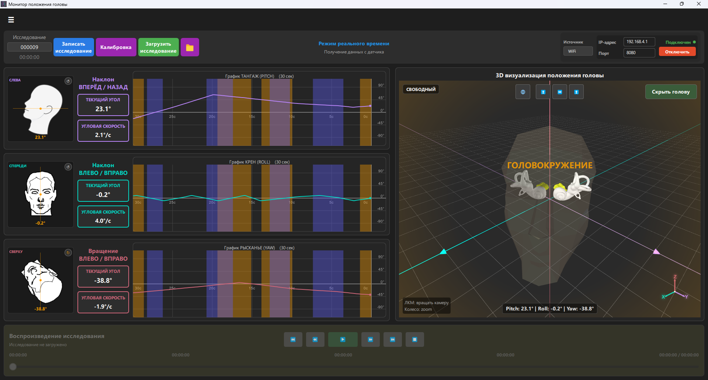
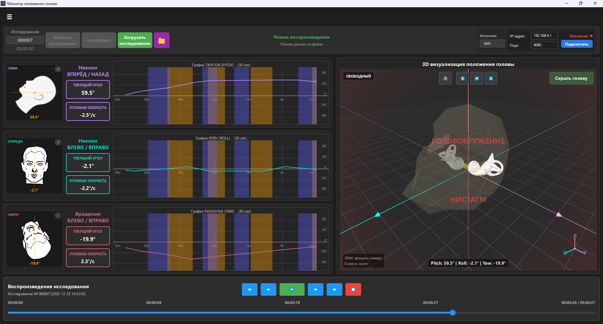
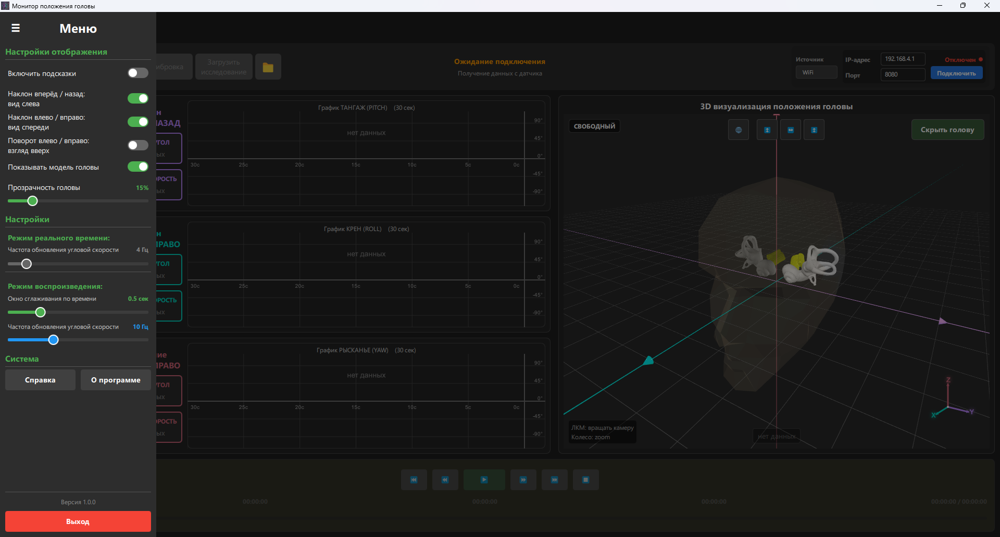
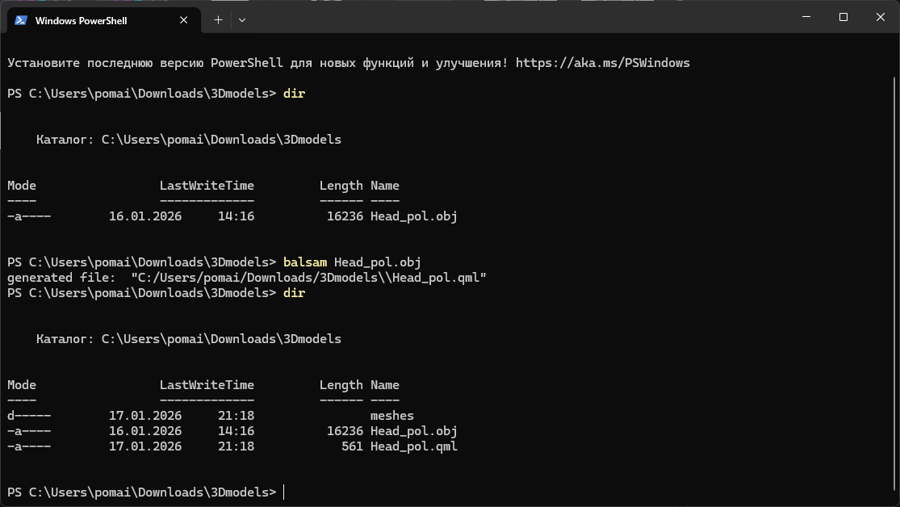
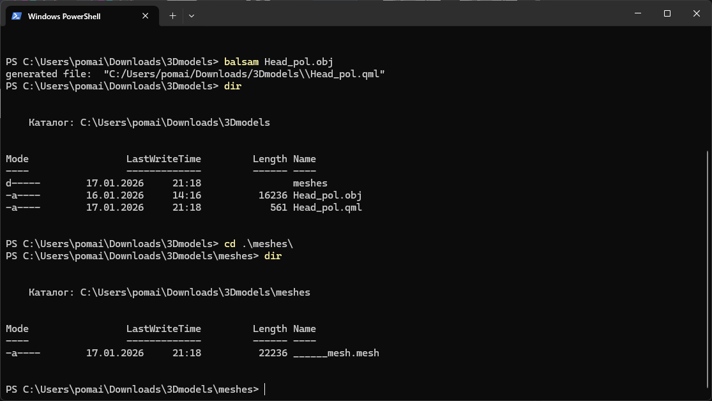

# MonitorHead



# Содержание

1. [О проекте](#о-проекте)
2. [Описание программы](#описание-программы)
3. [Описание пакета данных](#описание-пакета-данных)
4. [Передача данных по Wi-Fi](#передача-данных-по-wi-fi)
5. [Подготовка проекта к созданию установочного файла и запускаемого приложения](#подготовка-проекта-к-созданию-установочного-файла-и-запускаемого-приложения)
6. [Подготовка 3D-модели для ототбражения в области 3D сцены](#подготовка-3d-модели-для-ототбражения-в-области-3d-сцены)
7. [Доработки проекта](#доработки-проекта)
8. [Изменения по версиям](#изменения-по-версиям)


# О проекте

Проект был разработан для исследовательской работы для одного из медицинских научно-исследовательских институтов.

**Основная задача программы** — отслеживание положения головы в пространстве, субъективного ощущения пациентом головокружения, доктором - нистагма и предоставление данных доктору в удобочитаемом виде. 

Положение головы определяется с помощью датчиков. Субъективное ощущение пациентом головокружения, а доктором - нистагма, определяется по нажатию соответствующей кнопки пациентом или доктором. Данные с датчиков и кнопок собираются и передаются на компьютер по COM-порту или по Wi-Fi. Эти данные можно как записывать так читать из файлов-исследования.

На компьютере должна быть установлена и запущена программа **MonitorHead**, которая принимает данные от датчиков и кнопок и отображает их в своём графическом интерфейсе (GUI). 


# Описание программы

## Описание интерфейса

При запуске программы вы увидите окно программы:


*Рис. 2-01 - Основной интерфейс программы.*

В интерфейсе есть следующие элементы для отображения различной информации:

- **Кнопка - гамбургер** - кнопка открывающая меню, где можно найти основные настройки программы и кнопки `"Справка"`, `"О программе"` и `"Выход"` (рис. 2-04).
- **Информационная панель** - ключевая информация о работе приложения. Высвечивается в верхней части программы.
- **Панель управления** - содержит основные кнопки для управления, отображает текущий режим работы программы и настройки подключения:
  - Номер текущего исследования. В режиме *Исследования* показывает номер исследования, который будет присвоен файлу-исследования при нажатии на кнопку `"Записать исследование"`. В режиме *Воспроизведения* отображает номер загруженного исследования.
  - Секундомер, находящийся под номером исследования. Отображает время прошедшее с начала нажатия кнопки `"Записать исследование"`.
  - Основные кнопки управления:
    - `"Записать исследование"` - при нажатии на эту кнопку, производится запись данных поступающих с датчиков и кнопок.
    - `"Калибровка"` - позволяет выравнить голову, устанавливая все значения углов в 0.
    - `"Загрузить исследование"` - позволяет выбрать файл-исследования для работы с ним в программе, чтобы лучше визуализировать все цыфры.
    - `"Папка"` - открывает папку, где располагаются записанные файлы-исследования.
  - Текущий режим работы программы.
  - **Настройки подключения** - позволяют выбирать тип подключения и параметры самого подключения:
    - `Wi-Fi` - для правильного подключения нужно настроить IP-адрес, порт и нажать кнопку `"Подключить"`.
    - `COM` - для правильного подключения нужно выбрать номер порта и нажать кнопку `"Подключить"`.
- **Блок 2D-визуализации:**
  - Отдельные виджеты для углов тангажа (pitch), крена (roll) и рыскания (yaw).
  - Графическое и цифровое отображение углов положения головы.
  - Цифровое отображение угловой скорости.
  - Графики изменений углов наклона и поворота за последние 30 секунд, совмещённые с отметками о субъективном ощущении головокружения пациента и нистагма.
- **Блок 3D-визуализации:**
  - 3D-модель головы и внутреннего уха.
  - Отображение субъективного ощущения головокружения и нистагма.
  - Возможность вращать модель вокруг центра осей координат.
  - Кнопки настройки вида и отображения головы.
  - Отображение текущих значений углов.
- **Блок работы с файлом-исследования:**
  - Элементы управления воспроизведением (анимацией) данных из лога.
  - Информация о файле-исследования.
  - Ползунок для перемотки по временной шкале.

## Режимы работы программы

У программы есть три режима работы:

- режим ожидания подключения
- режим реального времени
- режим воспроизведения

### Режим ожидания подключения


*Рис. 2-01 - Программа в режиме ожидания подключения.*

Это режим в котором программа находится в ожидании подключения или выбора файла-исследования для воспроизведения.
В этом режиме отсутствует возможность записи исследования и калибровки по причине отстутсвися данных для записи и обнуления.

Если в этом режиме нажать на кнопку `"Загрузить исследование"` и выбрать файл, то программа перейдёт в режим воспроизведения.

Если в режиме ожидания подключения нажать кнопку `"Подключить"` одно из соединений, то программа перейдёт в режим реального вермени.

### Режим реального времени


*Рис. 2-02 - Программа в режиме реального времени.*

Это режим в котором происходит подключение датчика к программе через Wi-Fi или COM и плученные данные выводятся на экран. В этом же режиме возможно производить запись получаемых данных с помощью кнопки `"Записать исследование"`. Если данные в этом режиме приходят с неверными углами, то с помощью `"Калибровка"` можно обнулить положение углов.

Если в этом режиме нажать на кнопку `"Загрузить исследование"` и выбрать файл, то программа автоматически отключится от любого подключения и перейдёт в режим воспроизведения.

Если в режиме реального времени нажать кнопку `"Отключить"` любого из соединений, то программа перейдёт в режим ожидания подключения.

В этом режиме клавиша `"Пробел"` работает как старт/стоп записи файла-исследования.

### Режим воспроизведения


*Рис. 2-03 - Программа в режиме воспроизведения.*

Это режим в котором можно воспроизвести записанный файл-исследования. В этом режиме можно увидеть какие были углы наклона, угловую скорость, субъективное ощущение головокружения от пациента, нистагм от доктора, которые были во время записи данных.

В этом режиме можно рассматривать конкретный временной промежуток, перематывать время с помощью ползунка на таймлайне или с помощью кнопок. В этом режиме клавиша `"Пробел"` работает как старт/пауза воспроизведения.

## Боковое меню программы

Программа имеет боковое меню, вызываемое через кнопку-гамбургер, расположенную в верхнем левом углу интерфейса. Боковое меню можно увидеть на рисунке ниже


*Рис. 2-04 - Боковое меню программы.*

На рисунке видно что в меню есть переключатели, слайдеры и кнопки разделённые на группы:

- Настройки отображения - отвечают за визуальную часть интерфеса. Все кроме слайдера, отвечающего за настройку прозрачности головы на 3D-сцене, дублируют функционал интерфейса.
- Настройки - отвечают за частоту изменения текущего угла и угловой скорости. 
- Система - основные кнопки приложения с инофрмацией о программе и справкой.
- Кнопка выход - закрывает программу. 


# Описание пакета данных

## Файл-исследования

Ниже приведён типичный файл-исследования, записанный программой **Монитор положения головы** (MonitorHead).

```
##########
# Исследование № 000004
# 2025-12-14 21:42:25
##########
0000000010;-16.15;-1.10;-58.65;0;0
0000000030;-16.05;-0.95;-58.60;0;0
0000000056;-15.85;-0.80;-58.65;0;0
0000000074;-15.70;-0.70;-58.65;0;0
0000000092;-15.60;-0.55;-58.70;0;0
0000000104;-15.45;-0.35;-58.70;0;0
0000000117;-15.35;-0.20;-58.75;0;0
0000000145;-15.20;-0.05;-58.80;0;0
0000000165;-15.00;0.10;-58.75;0;0
0000000186;-14.80;0.20;-58.70;0;0
0000000208;-14.65;0.35;-58.65;1;0
0000000220;-14.45;0.50;-58.70;1;0
0000000241;-14.25;0.65;-58.70;1;0
0000000257;-14.15;0.75;-58.65;1;0
```

## Определение потребной скорости порта

Строка с максимальным количеством знаков, при этом знак `,` используется в качестве десятичного разделителя:

`0000000009;-111,80;-112,85;-113,80;0;0`

| № | Символы | Кол-во знаков | Байт | Описание (тип данных в программе) |
|---|---|---|---|---|
| 1 | `;` | 7 знаков | 7 | Разделитель данных. |
| 2 | `0000000009` | 10 знаков | 10 | Время прошедшее с момента запуска микроконтроллера в милисикундах [мс]. Увеличивается от 0000000000 до предедела int. (**INT**) |
| 3 | `-111,80` | 7 знаков | 7 | Угол по тангажу (PITCH). Диапазон: -180 ... 180 градусов. Точность: до сотых. (**FLOAT**) |
| 4 | `-112,85` | 7 знаков | 7 | Угол по крену (ROLL). Диапазон: -180 ... 180 градусов. Точность: до сотых. (**FLOAT**) |
| 5 | `-113,80` | 7 знаков | 7 | Угол по рысканью (YAW). Диапазон: -180 ... 180 градусов. Точность: до сотых. (**FLOAT**) |
| 6 | `0` | 1 знак | 1 | Ощущение головокружения от пациента: 0 - нет головокружения (кнопка отжата), 1 - есть головокружение (кнопка нажата). (**INT**) |
| 7 | `0` | 1 знак | 1 | Нистагм, сигнал от доктора: 0 - нет нистагма (кнопка отжата), 1 - есть нистагм (кнопка нажата). (**INT**) |
| 8 | `\n` или `\r\n` | 1 знак | 1 или 2 | Знак окончания строки. |
|   | **Итог** | **40 знаков** | **41 байт** |  |

41 знак в одном пакете/кадре/семпле.

1 пакет/кадр/семпл = 1 строка = 41 знак

Буду исходить из того, что нужно передавать 60 пакетов в секунду.

`60 пакетов/с × 41 байт/строка = **2460 байт/сек**`

UART передаёт 10 бит на байт (1 старт + 8 данных + 1 стоп; без чётности).

⚠️ Это важно! 1 байт = 10 бит на линии UART

`2460 байт/с × 10 бит/байт = **24 600 бит/с**`

Стандартные скорости UART:
- 9600
- 19200
- 38400
- 57600
- 115200
- 230400
- ...

Минимальная скорость которая выше 24 600 — это 38400, но лучше взять с запасом, потому что:

- Микроконтроллер (Arduino) может немного "проседать" при генерации данных.
- Приёмник (например, ПК) должен успевать читать.
- Нужен запас на возможные более длинные строки.

Для UART выбрана стандартная скорость (baud rate): скорость порта - 115200 бод.

Это даёт:

- Пропускную способность: 115200 / 10 = 11 520 байт/с.
- При потребности 2460 байт/с — запас более чем 4.6×.
- Устойчиво работает даже с SoftwareSerial (если вдруг понадобится).
- Поддерживается всеми терминалами и ОС.


# Передача данных по Wi-Fi

В данном проекте основным способ передачи данных выбран Wi-Fi 2.4ГГц, расположенный на ESP32. Для уменьшения вероятности тротлинага, из-за нагрева модуля, уменьшена мощность передатчика. Мощность передатчика влияет на дальность передачи данных и устойчивость сигнала. Но если быть точнее, то дальность передачи Wi-Fi на ESP32 зависит от многих факторов, ниже приведены примерные оценки:

## **Теоретическая дальность для 13 dBm (20 mW) на ESP32:**

### 📡 **В идеальных условиях (линия видимости, без помех):**
- **В помещении:** 15-25 метров (через 1-2 стены)
- **На открытом пространстве:** 50-100 метров

### 🏢 **В реальных условиях (с помехами):**
- **Через одну стену:** 10-15 метров
- **Через две стены:** 5-10 метров
- **В помещении с мебелью:** 8-15 метров

## 📊 **Сравнение мощностей и дальности:**

| Мощность | Примерная дальность (внутри) | Примерная дальность (снаружи) | Применение |
|----------|-----------------------------|-------------------------------|------------|
| **2 dBm** (1.6 mW) | 3-5 м | 10-15 м | Миниатюрные устройства, экономия энергии |
| **7 dBm** (5 mW) | 5-8 м | 15-25 м | Малые помещения |
| **11 dBm** (12.6 mW) | 8-12 м | 25-40 м | Средние помещения |
| **13 dBm** (20 mW) | **10-15 м** | **30-50 м** | **Оптимально для большинства помещений** |
| **15 dBm** (31.6 mW) | 12-18 м | 40-70 м | Большие помещения |
| **17 dBm** (50.1 mW) | 15-22 м | 50-90 м | Сложные условия, через стены |
| **19 dBm** (79.4 mW) | 18-25 м | 60-100 м | Максимальная дальность |

## 🔧 **Факторы, влияющие на дальность:**

### **Ухудшают связь (-):**
1. **Стены и перекрытия** (особенно железобетонные): -10-20 dB
2. **Мебель и люди**: -3-10 dB  
3. **Другие Wi-Fi сети (интерференция)**: -5-15 dB
4. **Электронные помехи** (микроволновки и т.д.): -5-20 dB
5. **Влажность воздуха**: -1-3 dB
6. **Неправильная ориентация антенны**: -3-10 dB

### **Улучшают связь (+):**
1. **Антенна на клиенте с усилением**: +3-10 dB
2. **Отсутствие помех**: +5-10 dB
3. **Линия видимости**: +10-20 dB
4. **Правильная поляризация антенн**: +3-6 dB

## 📶 **Практический пример:**

**Условия:** ESP32 с 13 dBm, помещение, 1 стена

**Принимающее устройство:** Обычный ноутбук/смартфон

```
Теоретический бюджет связи:
- Мощность передатчика: +13 dBm
- Потери в антенне ESP32: -2 dB
- Потери на 1 стене: -10 dB
- Потери на расстоянии 10 м: -50 dB
- Потери в антенне приемника: -2 dB
- Запас на помехи: -10 dB

Итого на приемнике: 13 - 2 - 10 - 50 - 2 - 10 = -61 dBm
```

**-61 dBm** - это хороший уровень сигнала! Порог чувствительности большинства устройств:
- **-30 dBm**: Отличный сигнал
- **-50 dBm**: Хороший сигнал  
- **-70 dBm**: Минимальный для стабильной связи
- **-80 dBm**: Предел обнаружения
- **-90 dBm**: Ниже порога чувствительности

## 🎯 **Вывод для проекта:**

**13 dBm (20 mW) - отличный выбор для:**
1. **Медицинского оборудования** в одной комнате (3-10 метров)
2. **Датчиков в операционной** (все устройства в пределах 5-15 метров)
3. **Минимизации нагрева** и энергопотребления
4. **Снижения интерференции** с другим оборудованием

**Если связь обрывается:**
1. **Попробуйте 17 dBm** - скорее всего решит проблему
2. **Проверьте антенну ESP32** (она должна быть прямой и не закрытой)
3. **Уберите источники помех** (микроволновки, другие Wi-Fi роутеры)
4. **Измените канал Wi-Fi** (сейчас стоит 6, попробуйте 1 или 11)

**13 dBm должно хватить для 99% случаев использования в помещении!** Если нужно больше дальности - увеличьте до 17 dBm.


# Подготовка 3D-модели для ототбражения в области 3D сцены

Для создания 3D-модели (в формате *.mesh) для 3D-сцены Qt(QML) сначало нужно подготовить модель в формате *.obj. Для этого нужно использовать инструмент `balsam` встроенный в пакет установки Qt.

## Подготовка программы для работы в системе

Для начала нужно сделать так, чтоб `balsam` запускался из консоли. 

Для Windows:

```
Проверяем где лежит файл balsam:
# Ищите в папках Qt
C:\Qt\<версия>\<компилятор>\bin\balsam.exe
C:\Qt\Tools\QtQuick3D\<версия>\bin\balsam.exe

# В моей системе
C:\Qt\6.10.0\llvm-mingw_64\bin\balsam.exe
```

Для того чтобы `balsam.exe` запускался из консоли, добавляем в переменную среды `Path`:

```
C:\Qt\6.10.0\llvm-mingw_64\bin
```

## Конвертирование *.obj в *.mesh

`balsam.exe` может конвертировать файлы *.obj, *.gltf, *.glb, *.fbx.

Для того чтобы конвертировать *.obj в *.mesh нужно запустить консоль и перейти в папку где лежит исходный файл *.obj. 


```
# Конвертация из .obj в .mesh
# model - название файла модели
balsam model.obj 
```



Конвертированный файл будет распологаться в папке `meshes` с именем `______mesh.mesh`

`

Полученный файл `______mesh.mesh` можно переименовать для своего проекта и перенести его в папку проекта.


# Подготовка проекта к созданию установочного файла и запускаемого приложения

## Создание запускаемого приложения для выноса на стороннюю машину

1. В Qt устанавливаем выпуск на релизную версию. Собираем проект.
У меня проект собирался в папку `C:\Users\pomai\programming\code\projects\qt_qml\MonitorHead\build` в папку `Desktop_Qt_6_10_0_MinGW_64_bit-MinSizeRel`.

2. Саму программу можем закрывать. И переходим в папку собранного проекта `C:\Users\pomai\programming\code\projects\qt_qml\MonitorHead\build\Desktop_Qt_6_10_0_MinGW_64_bit-MinSizeRel`

```
bash

cd C:/Users/pomai/programming/code/projects/qt_qml/MonitorHead/build/Desktop_Qt_6_10_0_MinGW_64_bit-MinSizeRel
```

Зайдя в эту папку и попробовав запустить проект MonitorHead.exe
```
./MonitorHead.exe
```
мы получим следующие ошибки:
1. Не удаётся продолжить выполнение кода, поскольку система не обнаружила libgcc_s_seh-1.dll. Для устранения этой проблемы попробуйте переустановить программу.
2. Не удаётся продолжить выполнение кода, поскольку система не обнаружила libstdc++-6.dll. Для устранения этой проблемы попробуйте переустановить программу.

```
# 1. Перейдите в папку сборки
cd C:/Users/pomai/programming/code/projects/qt_qml/MonitorHead/build/Desktop_Qt_6_10_0_MinGW_64_bit-MinSizeRel

# 2. Удалите все DLL (кроме вашего .exe)
rm *.dll

# 3. Запустите windeployqt
# C:/ваш_проект/qml - путь где лежат ваши qml файлы (у меня они лежат в корне проекта)
C:/Qt/6.10.0/mingw_64/bin/windeployqt.exe --release --qmldir C:/Users/pomai/programming/code/projects/qt_qml/MonitorHead MonitorHead.exe

# 4. Запустите приложение
./MonitorHead.exe
```

Теперь эту папку можно переносить на другую машину.

## Создание установочного файла

Для создания установочного файла будем использовать **Inno Setup Compiler**.

Для начала очистим релизный проект от лишних файлов и папок. Для этого я использовал скрипт `prepare_release.sh` из папки `script_exe`. Запускаем из следующую строку из корня проекта:

```
./script_exe/prepare_release.sh
```

Далее я использовал программу Inno Setup Compiler для неё создал скрипт `MonitorHead.iss` из папки `script_exe`.

Чтобы запустить компилящию установочного файла можно нажать `Ctrl+F9` или `Build->Compile`.

Выходной файл у меня сохраняется в папку: `C:\Users\pomai\programming\executable_files\`. По этому пути можно найти файл `MonitorHead_Setup.exe`


# Доработки проекта

## Первостепенные (версия 1)

1. Сделать так чтобы голова на 2Д виде смотрела вверх.
2. Поменять модель головы на человеческую. И добавить туда внутреннее ухо.
3. Увеличить 3Д вид, чтоб он занимал больше места в основном интерфейсе. Но при этом оставить максимальный размер чтоб оставался в рамках формы квадрата.
4. Сделать так чтоб файл записанных данных записывался сразу в виде эксель файла.
5. Улучшить описание программы.


# Изменения по версиям

## 1.0.0 (15.12.2025)

Основная программа, большая часть функционала уже сделана

## 1.1.0 (19.01.2026)

- Доработка 3D-сцены:
  - Заменена модель головы на человеческую полигональную
  - Добавлены модели внутреннего уха
  - Добавлена миниатюрная система координат
  - Заменены значки переключения видов на более подходящие
  - Кнопка "Скрыть голову/Прказать голову" приведена к общему стилю кнопок приложения
- Боковое меню:
  - Изменён переключатель "Поворот влево-вправо (взгляд вверх)" так, чтобы при загрузке программы голова смотрела вверх
  - Добавлен слайдер для настройки прозрачности головы
